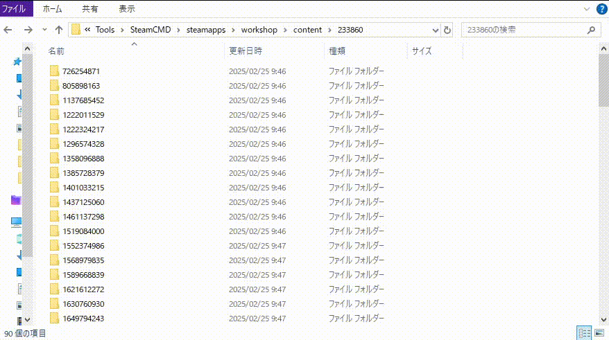

# Alvind0.KenshiModFolderRenamer

**Easily rename your Kenshi Steam Workshop mods so they are recognized by the game launcher!(Non-Steam)**

This Python script automates the process of renaming folders of Kenshi Steam Workshop mods for non-Steam installations(e.g. GOG Games). The Kenshi game launcher fails to recognize mods downloaded directly from the Steam Workshop due to naming conventions used by Steam. This script renames the mod folders to a format that the Kenshi launcher understands, ensuring your subscribed mods are correctly loaded and playable.



## Prerequisites

- **Python 3:** You need Python installed on your system. You can download it from [python.org](https://www.python.org/). You can check if you have Python installed by opening your terminal or command prompt and typing `python --version` or `python3 --version`.

## Usage

> [!Important]
> Backup your `mods` folder before running this script!
> While this script is designed to be safe, it's always a good practice to backup your data before making changes.

1. **Download the Script:** Download the `kenshi_mod_renamer.py` file and place it in your Kenshi `mods` folder.

   - **Finding your `mods` folder:** The location of your Kenshi `mods` folder usually depends on your installation. A common location is within your Steam installation directory, something like:
     ```
     [Steam Installation Directory]/steamapps/common/Kenshi/mods/
     ```
     You can often find your Steam installation directory by right-clicking Kenshi in your Steam library, going to "Properties," then "Installed Files," and clicking "Browse."

2. **Run the Script:** Open a terminal or command prompt. Navigate to your Kenshi `mods` folder (where you placed the `kenshi_mod_renamer.py` script).

3. **Execute the script:** You can just run the script, or use PowerShell to see the logs.
   Here is the powershell command.
   ```powershell
   cd your_kenshi_mod_folder
   python kenshi_mod_renamer.py
   ```
   Replace your_kenshi_mod_folder with your Kenshi mod folder.
   For example, if your mod folder is in C:\GOG Games\Kenshi\mods, the command will be:

```powershell
cd '.\GOG Games\Kenshi\mods\'
```
